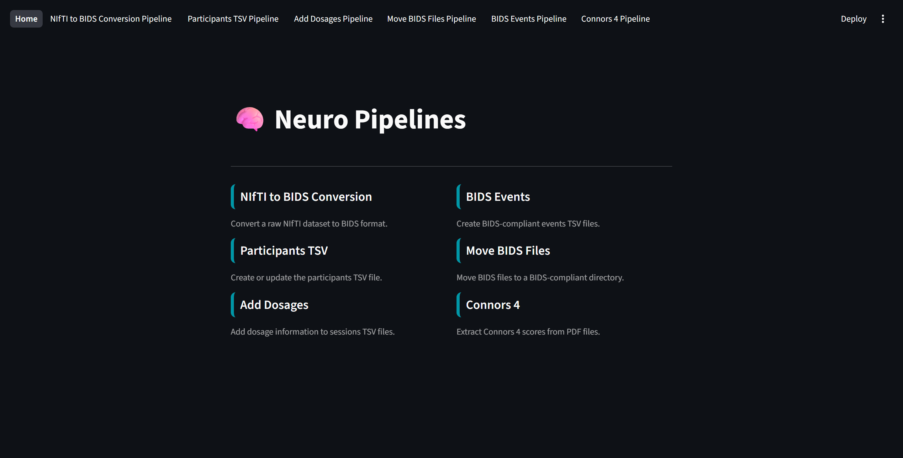
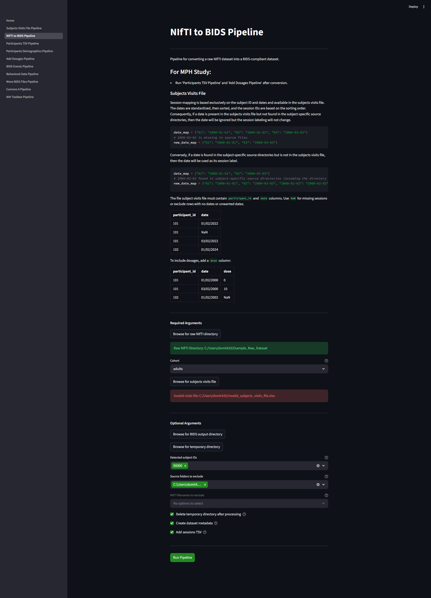

# Neuro Pipelines

Neuroimaging pipelines tailored for specific tasks and scan protocols in a multi-session, pharmacological fMRI study.

**Requires Python 3.10+**

[Get Python 3.13 on Windows Store](https://apps.microsoft.com/detail/9PNRBTZXMB4Z?hl=en-us&gl=US&ocid=pdpshare)

[Get Python 3.13 on Python.org](https://www.python.org/downloads/release/python-31313/)

## Available Tools

- BIDS conversion
- Event (timing) file creation
- Preprocessing
- First and second level analyses (GLM and gPPI)
- Miscellaneous utilities

## Installation

Clone the repository:

```bash
git clone https://github.com/donishadsmith/neuro_pipelines
cd neuro_pipelines
```

### Local Workstation

Install packages directly:

```bash
pip install -r requirements.txt
```

Or use a virtual environment:

```bash
python -m venv venv

# Linux
source venv/bin/activate

# Windows
venv\Scripts\activate

pip install -r requirements.txt
```

#### Run Streamlit App Hub
Double click on "launch_app.bat" (Windows) or "launch_app.sh" (Linux/Mac).

or 

In terminal:
```bash
streamlit run app.py
```
##### Homepage


##### NIfTI to BIDS Pipeline Conversion Page


### HPC (Conda)

```bash
conda create -n venv python=3.10
source activate venv
pip install -r requirements.txt
```
